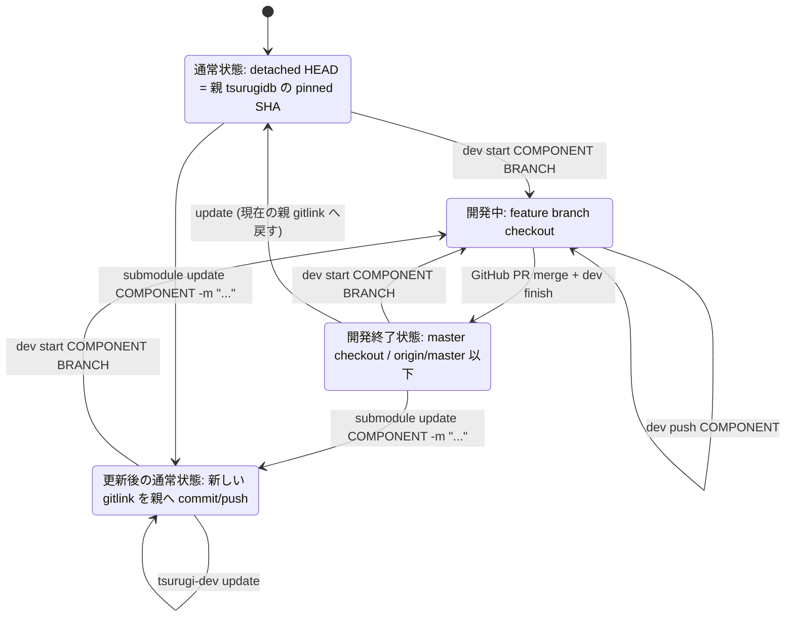
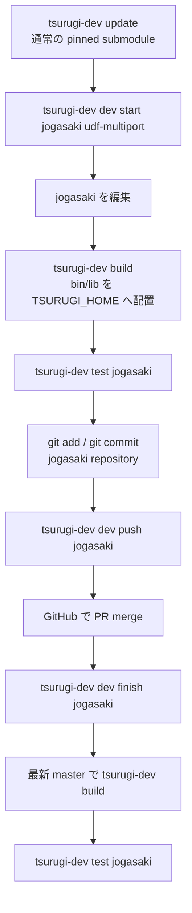
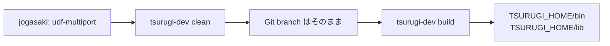
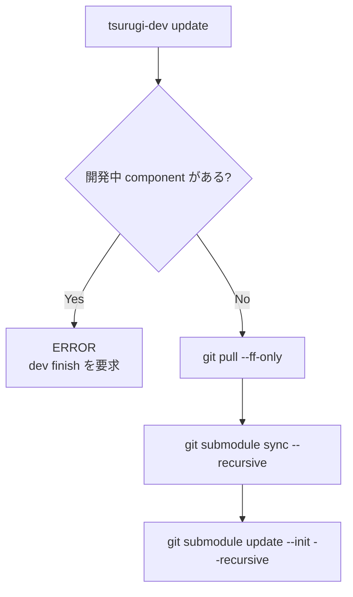

# tsurugi-dev

`project-tsurugi/tsurugidb` の公式 `install.sh` を利用する開発用 CLI です。

Tsurugi 各コンポーネントのビルド順序や通常の CMake オプションは再実装せず、公式 installer に任せます。このツールは、開発環境で頻繁に必要になる **環境設定、フルビルド、差分ビルド、clean、update、submodule 直接開発、component 単位の CTest、submodule gitlink 更新、検証**を整理します。

Python の外部 runtime dependency はありません。Python 3.10 以上を使用します。

______________________________________________________________________

## 1. tsurugi-dev 自体のインストール

このリポジトリで次を実行します。

```bash
python3 -m pip install -e .
```

editable install なので、`src/tsurugi_dev/` を変更すると再インストールせず反映されます。

確認:

```bash
tsurugi-dev --version
tsurugi-dev --help
```

`pip` を使わず実行したい場合も、source tree で次の形式が使えます。

```bash
PYTHONPATH=src python3 -m tsurugi_dev --help
```

______________________________________________________________________

## 2. 環境設定

通常は `~/.bashrc` などに次を設定します。

```bash
# Git checkout をまとめて置く基準ディレクトリ
export TSURUGI_DEV_WORKSPACE="${HOME}/git"

# Tsurugi runtime
export TSURUGI_HOME="${TSURUGI_DEV_WORKSPACE}/.local-relwithdebinfo"
export TSURUGI_CONF="${HOME}/tsurugi.ini"

export PATH="${TSURUGI_HOME}/bin:${PATH}"
export LD_LIBRARY_PATH="${TSURUGI_HOME}/lib${LD_LIBRARY_PATH:+:${LD_LIBRARY_PATH}}"

# 任意: build 用 Java 17+ を明示したい場合だけ設定
# export TSURUGI_DEV_JAVA_HOME=/usr/lib/jvm/java-17-openjdk-amd64
```

`TSURUGI_DEV_WORKSPACE` は Tsurugi 関連の Git checkout を置く基準ディレクトリです。未設定時は `${HOME}/git` を使用します。通常の `tsurugidb` source tree は次になります。

```text
${TSURUGI_DEV_WORKSPACE}/tsurugidb
```

反映:

```bash
source ~/.bashrc
```

`tsurugi-dev` は `--home` がない場合、次の順番で Tsurugi home を決定します。

1. `$TSURUGI_HOME`
1. `${TSURUGI_DEV_WORKSPACE}/tsurugi`

`tsurugidb` source tree は `--repo` がない場合、次を使用します。

```text
${TSURUGI_DEV_WORKSPACE}/tsurugidb
```

`TSURUGI_DEV_WORKSPACE` 自体が未設定なら `${HOME}/git` です。

そのため、通常は `--home` を毎回指定する必要はありません。

`TSURUGI_CONF` が設定されていればそれを使用し、未設定なら `${TSURUGI_HOME}/var/etc/tsurugi.ini` を使用します。

現在の設定に対応する export を表示するには:

```bash
tsurugi-dev env
```

例:

```text
export TSURUGI_DEV_WORKSPACE=/home/user/git
export TSURUGI_HOME=/home/user/git/.local-relwithdebinfo
export TSURUGI_CONF=/home/user/tsurugi.ini
export PATH="${TSURUGI_HOME}/bin:${PATH}"
export LD_LIBRARY_PATH="${TSURUGI_HOME}/lib${LD_LIBRARY_PATH:+:${LD_LIBRARY_PATH}}"
```

### Java の扱い

シェル側の `JAVA_HOME` / `java` が Java 11 でも、そのままで構いません。`tsurugi-dev` は Harinoki を含む build では Java 17 以上が必要かを判定し、Java 17+ が別にインストールされていれば **build subprocess 内だけ** `JAVA_HOME` と `PATH` を切り替えます。呼び出し元シェルの環境は変更しません。

探索順は次です。

1. `--java-home`
1. `$TSURUGI_DEV_JAVA_HOME`
1. 現在の `PATH` 上の Java（17以上の場合）
1. `$JAVA_HOME`（17以上の場合）
1. `/usr/lib/jvm` 以下（Java 17を優先）

Java 17+ が見つからない場合は、core/server build を止めないため `harinoki` を自動的に skip します。

### UDF 用のパス

`TSURUGI_PROTO` は Tsurugi 本体の標準環境変数としては扱いません。UDF 開発用の基準ディレクトリが必要なら、例えば次のように分離します。

```bash
export TSURUGI_UDF_HOME="${HOME}/git/tsurugi-udf"
```

proto は `${TSURUGI_UDF_HOME}/proto` として参照します。

______________________________________________________________________

## 3. 初回準備

手動で `tsurugidb` を clone する必要はありません。環境設定後、まず次を実行します。

```bash
tsurugi-dev update
```

デフォルトでは次の repository を対象にします。

```text
git@github.com:project-tsurugi/tsurugidb.git
    ↓
${TSURUGI_DEV_WORKSPACE}/tsurugidb
```

`${TSURUGI_DEV_WORKSPACE}/tsurugidb` が存在しない場合は、自動的に次相当を実行します。

```bash
git clone git@github.com:project-tsurugi/tsurugidb.git \
  "${TSURUGI_DEV_WORKSPACE}/tsurugidb"
```

repository がすでに存在する場合、clone はスキップします。その後、既存 repository では `git pull --ff-only` を行い、どちらの場合も submodule を現在の `tsurugidb` commit に合わせます。

```bash
git submodule sync --recursive
git submodule update --init --recursive
```

したがって初回も通常の更新も同じコマンドです。

```bash
tsurugi-dev update
```

ビルド前の確認:

```bash
tsurugi-dev doctor
```

依存 OS package が未導入なら、Tsurugi 側の公式手順で導入してください。

______________________________________________________________________

## 4. フルビルド

初回、ビルド設定変更後、build tree の不整合が疑われる場合は:

```bash
tsurugi-dev full-build
```

`full-build` は公式 installer に `TG_CLEAN_BUILD=clean` を設定して実行します。

旧 `build_all.sh` で実績のある環境との互換設定は **デフォルトで有効**です。通常は `--legacy-build-all-compat` や `--skip=harinoki` を毎回指定する必要はありません。互換設定を明示的に無効化したい場合だけ `--no-build-all-compat` を使用します。

Java についても自動判定されます。例えばシェルの Java が 11 で `/usr/lib/jvm/java-17-openjdk-amd64` が存在する場合、build の間だけ Java 17 を使用します。

デフォルト build type:

```text
RelWithDebInfo
```

Debug:

```bash
tsurugi-dev full-build --build-type Debug
```

### 並列数

デフォルトは:

```text
--parallel auto
```

です。

`auto` は次の情報から並列数を決めます。

- `sched_getaffinity()` でこのプロセスが使用可能な CPU 数
- Linux `/proc/meminfo` の `MemAvailable`

メモリ側は安全側の初期値として、2 GiB を OS 等のために残し、C/C++ build 1 job あたり 2 GiB と見積もります。

実行時に決定値を表示します。

```text
parallel: 12 (auto: cpu=16, memory=27.5 GiB, memory-limit=12)
```

明示指定もできます。

```bash
tsurugi-dev full-build --parallel 8
```

通常は `--parallel` を指定せず auto のまま使うことを推奨します。

______________________________________________________________________

## 5. 差分ビルド

通常のソース修正後はこちらを使います。

```bash
tsurugi-dev build
```

同じ意味の alias:

```bash
tsurugi-dev diff-build
```

公式 installer に:

```text
TG_CLEAN_BUILD=keep
```

を設定するため、既存 CMake/Ninja build tree を残したまま再構成・再ビルドします。

通常の component 開発では `${TSURUGI_DEV_WORKSPACE}/tsurugidb` 配下の submodule をそのまま編集します。

```bash
tsurugi-dev dev start jogasaki udf-multiport

cd "${TSURUGI_DEV_WORKSPACE:-$HOME/git}/tsurugidb"
vi jogasaki/...

tsurugi-dev build
tsurugi-dev test jogasaki
```

`~/git/jogasaki` のような開発用 clone は必要ありません。

`--component-dir` は、別 checkout を意図的に installer へ渡したい特殊用途のために残しています。通常の `dev start` / `dev finish` フローでは使用しません。

```bash
tsurugi-dev build \
  --component-dir data-relay-grpc=~/git/data-relay-grpc
```

現在の公式 installer が持つ `TG_*_DIR` を利用するため、ラッパー側で各コンポーネントのビルド手順を複製しません。

______________________________________________________________________

## 6. clean

以前の build/install 環境を更地にします。

```bash
tsurugi-dev clean
```

デフォルトでは次を削除します。

- 既知の CMake / Ninja build output
- `tsubakuro` / `tanzawa` / `harinoki` の Gradle build output
- このツールが作成した versioned install tree
- それを指す `TSURUGI_HOME` symlink

**Git source tree、submodule の commit、開発 branch は削除しません。**
そのため、ソースの開発状態を保持したまま build/install だけを作り直せます。

削除対象だけ確認:

```bash
tsurugi-dev clean --dry-run
```

`tsubakuro` / `tanzawa` / `harinoki` の Gradle clean を行わない場合:

```bash
tsurugi-dev clean --skip-gradle
```

install tree を残して build output だけ削除したい場合:

```bash
tsurugi-dev clean --keep-install
```

______________________________________________________________________

## 7. update

`update` は source tree の初期作成と通常更新の両方を担当します。

```bash
tsurugi-dev update
```

### repository が存在しない場合

`TSURUGI_DEV_WORKSPACE` が `/home/nishimura/git` なら、次へ clone します。

```text
/home/nishimura/git/tsurugidb
```

clone 元は固定で次です。

```text
git@github.com:project-tsurugi/tsurugidb.git
```

clone 後、submodule を初期化します。

### repository が存在する場合

clone はスキップし、内部で次を実行します。

```bash
git pull --ff-only
git submodule sync --recursive
git submodule update --init --recursive
```

親 repository を pull せず、現在の commit に対応する submodule だけ揃える場合:

```bash
tsurugi-dev update --no-pull
```

`--no-pull` を指定していても source tree 自体が存在しない場合は clone します。

submodule update の並列数:

```bash
tsurugi-dev update --jobs 8
```

実行予定だけ確認:

```bash
tsurugi-dev update --dry-run
```

`update` は `git submodule update --init --recursive` により各 component を親 `tsurugidb` が記録している commit へ戻す操作を含みます。
そのため、`jogasaki` などで開発 branch が checkout されている場合は、開発中の HEAD を意図せず差し替えないよう **実行を拒否**します。

開発が完了している場合は先に:

```bash
tsurugi-dev dev finish jogasaki
```

を実行してください。

______________________________________________________________________

## 8. component 開発のユースケースと状態遷移

通常の開発では、`${TSURUGI_DEV_WORKSPACE}/tsurugidb/jogasaki` など **親 `tsurugidb` 配下の submodule をそのまま Git working tree として使用**します。
別の `~/git/jogasaki` clone は作りません。

### 8.1 コマンドの役割

| 目的 | コマンド |
| --- | --- |
| source/submodule を親 commit に揃える | `tsurugi-dev update` |
| build/install 環境を更地にする | `tsurugi-dev clean` |
| build して `TSURUGI_HOME/bin`, `lib` へ配置 | `tsurugi-dev build` |
| component 開発 branch を作る | `tsurugi-dev dev start COMPONENT BRANCH` |
| component の開発状態を見る | `tsurugi-dev dev status [COMPONENT]` |
| component の CTest を実行 | `tsurugi-dev test COMPONENT` |
| component branch を push | `tsurugi-dev dev push COMPONENT` |
| PR merge 後に local branch を削除し最新 `master` へ戻る | `tsurugi-dev dev finish COMPONENT` |
| 親 `tsurugidb` の submodule gitlink を最新版へ更新 | `tsurugi-dev submodule update COMPONENT -m "..."` |

### 8.2 submodule の状態遷移

`tsurugi-dev` では、submodule の Git 状態を大きく次の4状態として扱います。



重要なのは **component repository の `master`** と **親 `tsurugidb` が保持する gitlink** は別物だという点です。

- `tsurugi-dev dev finish jogasaki`
  - `jogasaki` を最新 `origin/master` へ戻す
  - local feature branch を削除する
  - 親 `tsurugidb` の gitlink は変更しない
- `tsurugi-dev submodule update jogasaki -m "..."`
  - `git submodule update --remote jogasaki` 相当で最新 commit を取得する
  - 親 `tsurugidb` の `jogasaki` gitlink だけを stage
  - 親 repository を commit
  - デフォルトでは親 repository も push

### 8.3 Jogasaki を改造して PR merge する

一連の流れは次です。



コマンドだけ並べると:

```bash
# 開発開始
tsurugi-dev dev start jogasaki udf-multiport

# 編集
cd "${TSURUGI_DEV_WORKSPACE:-$HOME/git}/tsurugidb/jogasaki"
vi ...

# Tsurugi 全体を差分 build/install
cd ..
tsurugi-dev build

# Jogasaki の CTest
tsurugi-dev test jogasaki

# Jogasaki repository に commit
cd jogasaki
git add ...
git commit -m "..."

# feature branch push
cd ..
tsurugi-dev dev push jogasaki
```

GitHub で PR を merge した後:

```bash
# origin/master を取得
# master に戻す
# local feature branch を削除
tsurugi-dev dev finish jogasaki

# merge 後の master で再検証
tsurugi-dev build
tsurugi-dev test jogasaki
```

`dev finish` は通常 merge なら feature branch が `origin/master` に含まれることを確認してから `git branch -d` します。

GitHub で **Squash and merge** または **Rebase and merge** した場合は、元の feature branch commit が `origin/master` の祖先にならない場合があります。
PR が確実に merge 済みで、local branch を捨ててよいことを確認した場合だけ:

```bash
tsurugi-dev dev finish jogasaki --force-delete
```

を使用します。

### 8.4 build/install を完全に作り直して検証する

Git の開発 branch を保持したまま build/install だけ更地にできます。

```bash
tsurugi-dev clean
tsurugi-dev build
tsurugi-dev test jogasaki
```

例えば `udf-multiport` branch 上でも `clean` 自体は branch を削除しません。



### 8.5 親 tsurugidb の submodule commit を更新する

component の PR merge と `dev finish` が終わった後、親 `tsurugidb` が指す commit も更新したい場合:

```bash
tsurugi-dev submodule update jogasaki \
  -m "Update jogasaki"
```

これは概ね次を実行します。

```bash
git submodule update --remote jogasaki
git add -- jogasaki
git commit -m "Update jogasaki"
git push
```

`git add .` ではなく **`git add -- jogasaki`** を使い、対象 gitlink だけを stage します。
親 `tsurugidb` に別の変更が存在する場合は、無関係な変更を巻き込まないよう自動 commit を拒否します。

親 commit だけ作成して push は自分で行いたい場合:

```bash
tsurugi-dev submodule update jogasaki \
  -m "Update jogasaki" \
  --no-push
```

#### 開発中なら submodule update を拒否する

例えば:

```text
jogasaki:
  branch: udf-multiport
  state:  development
```

の状態では:

```bash
tsurugi-dev submodule update jogasaki -m "Update jogasaki"
```

を拒否します。

先に GitHub merge を完了し:

```bash
tsurugi-dev dev finish jogasaki
```

で **開発終了状態**へ戻してから再実行します。

確認には:

```bash
tsurugi-dev dev status jogasaki
```

を使います。

正常な例:

```text
jogasaki:
  branch: master
  HEAD:   0123456789ab
  pinned: fedcba987654
  state:  finished (clean master, synchronized with origin/master)
```

または通常の pinned submodule:

```text
jogasaki:
  branch: (detached)
  HEAD:   fedcba987654
  pinned: fedcba987654
  state:  finished (pinned detached HEAD fedcba987654)
```

### 8.6 `update` と開発 branch の衝突

次の操作は危険です。

```text
jogasaki feature branch で開発中
        |
        +--> git submodule update --init --recursive
                 |
                 +--> 親 tsurugidb の pinned SHA へ checkout
```

そのため:

```bash
tsurugi-dev update
```

は開発中 component を検出した場合に停止します。



基本ルールは:

```text
開発開始
  dev start
      ↓
開発・テスト・push
      ↓
GitHub merge
      ↓
  dev finish
      ↓
必要なら submodule update
      ↓
通常の update が安全に使える
```

______________________________________________________________________

## 9. doctor

ビルド前の簡易診断です。

```bash
tsurugi-dev doctor
```

主に次を表示・確認します。

- `TSURUGI_HOME`
- `TSURUGI_CONF`
- auto parallel の決定値
- `git`, `cmake`, `ninja`, `make`, `tar`, `curl`, `java`
- 必要な submodule checkout
- Git branch / HEAD

standalone checkout を診断対象に含める場合:

```bash
tsurugi-dev doctor \
  --component-dir data-relay-grpc=~/git/data-relay-grpc
```

______________________________________________________________________

## 10. verify

インストール結果を確認します。

```bash
tsurugi-dev verify
```

主な確認対象:

```text
bin/tsurugidb
bin/tgctl
bin/tgsql
bin/tgdump
lib/libtsubakuro.so*
var/etc/tsurugi.ini
var/data
var/blob/sessions
var/plugins
TSURUGI_CONF
```

`ldd` が使用できる場合、`${TSURUGI_HOME}/bin/tsurugidb` の unresolved shared library (`not found`) も確認します。

______________________________________________________________________

## 11. TSURUGI_HOME と install directory

公式 `install.sh` は `--prefix` の下に:

```text
tsurugi-<version>
```

を作ります。

このツールは開発用 version 名を固定し、例えば RelWithDebInfo では実体を:

```text
~/git/tsurugi-dev-relwithdebinfo
```

へ作ります。

`TSURUGI_HOME` が:

```text
~/git/.local-relwithdebinfo
```

なら、成功後に:

```text
~/git/.local-relwithdebinfo -> ~/git/tsurugi-dev-relwithdebinfo
```

という symlink を作ります。

旧スクリプトにより `${TSURUGI_HOME}` が実 directory の場合は、最初に退避するのが安全です。

```bash
mv "${TSURUGI_HOME}" "${TSURUGI_HOME}.old"
tsurugi-dev full-build
```

バックアップ済みで意図的に置換する場合のみ:

```bash
tsurugi-dev full-build --replace-home
```

`--replace-home` は既存の通常 file/directory を削除する破壊的オプションです。

______________________________________________________________________

## 12. 引数一覧

### グローバル

#### `--repo PATH`

`tsurugidb` source tree を明示的に上書きします。通常は指定不要です。

デフォルト:

```text
${TSURUGI_DEV_WORKSPACE}/tsurugidb
```

`TSURUGI_DEV_WORKSPACE` が未設定なら:

```text
~/git/tsurugidb
```

別 checkout を意図的に使用するときだけ指定します。

```bash
tsurugi-dev --repo ~/work/tsurugidb build
```

`update` で指定先が存在しない場合は、そのパスへ `git@github.com:project-tsurugi/tsurugidb.git` を clone します。

`--repo` は subcommand より前に指定します。

#### `--version`

`tsurugi-dev` 自体の version を表示します。

______________________________________________________________________

### `full-build` / `build`

#### `--home PATH`

runtime の Tsurugi home。

優先順位:

1. `--home`
1. `$TSURUGI_HOME`
1. `${TSURUGI_DEV_WORKSPACE}/tsurugi`

#### `--prefix PATH`

公式 installer の install parent directory。省略時は `TSURUGI_HOME` の親 directory。

#### `--build-type TYPE`

指定可能値:

```text
Debug
Release
RelWithDebInfo
```

デフォルトは `RelWithDebInfo`。

#### `--name NAME`

公式 installer に渡す開発用 version 名。省略時は `dev-<build-type>`。

通常は指定不要です。

#### `--parallel auto|N`

build の並列数。デフォルトは `auto`。

```bash
tsurugi-dev build --parallel auto
tsurugi-dev build --parallel 8
```

`auto` は CPU affinity と `MemAvailable` から数値に解決し、公式 installer へ必ず `--parallel=<数値>` として渡します。

#### `--component-dir COMPONENT=PATH`

特定 component を submodule ではなく外部 checkout へ差し替えます。繰り返し指定可能。

指定可能 component:

```text
data-relay-grpc
harinoki
jogasaki
limestone
mizugaki
sharksfin
shirakami
takatori
tanzawa
tateyama
tateyama-bootstrap
tsubakuro
yakushima
yugawara
```

#### `--ccache`

C/C++ compiler launcher に `ccache` を使用します。PATH にない場合はエラー。

#### `--tracy`

共通 CMake option に `-DTRACY_ENABLE=ON` を追加。

#### `--altimeter`

共通 CMake option に `-DENABLE_ALTIMETER=ON` を追加。

#### `--no-jemalloc`

Tateyama Bootstrap の jemalloc を無効化。

#### `--force-mpdecimal`

公式 installer に bundled mpdecimal のインストールを強制。

#### `--no-build-all-compat`

デフォルトで有効な旧 `build_all.sh` 互換設定を無効化します。通常は指定不要です。互換設定では Jogasaki の Arrow/Parquet object に C++20 を明示し、`${TSURUGI_DEV_WORKSPACE}/.opt` が存在する場合は CMake package 探索先として優先します。

#### `--java-home PATH`

自動検出ではなく、build に使用する Java 17+ の `JAVA_HOME` を明示します。シェル全体の `JAVA_HOME` は変更しません。

```bash
tsurugi-dev full-build --java-home /usr/lib/jvm/java-17-openjdk-amd64
```

#### `--cmake-option=-DNAME=VALUE`

`TG_COMMON_CMAKE_BUILD_OPTIONS` に追加。繰り返し指定可能。

```bash
tsurugi-dev build \
  --cmake-option=-DFOO=ON \
  --cmake-option=-DBAR=VALUE
```

#### `--shirakami-option=-DNAME=VALUE`

`TG_SHIRAKAMI_OPTIONS` に追加。繰り返し指定可能。

#### `--skip TARGET`

公式 installer の group をスキップ。指定可能値:

```text
server
nativelib
tanzawa
harinoki
grpc
```

`grpc` は通常の Data Relay gRPC と Tateyama の gRPC support を公式 installer の仕組みで無効化します。

#### `--replace-config SECTION.KEY=VALUE`

公式 `--replaceconfig` に転送。繰り返し指定可能。

#### `--replace-home`

既存の非 symlink `TSURUGI_HOME` を、ビルド成功後に新 install tree への symlink へ置換。破壊的。

#### `--verbose`

公式 installer の verbose output を有効化。

#### `--dry-run`

コマンドを表示するだけで実行しない。

______________________________________________________________________

### `clean`

`--home`, `--prefix`, `--build-type`, `--name`, `--component-dir` に加え:

#### `--skip-gradle`

Gradle clean を行わない。

#### `--keep-install`

versioned install tree と対応する `TSURUGI_HOME` symlink を残す。
指定しない場合、`clean` は build output と install tree の両方を削除します。

#### `--dry-run`

削除対象のみ表示。

______________________________________________________________________

### `update`

#### `--no-pull`

親 `tsurugidb` の `git pull --ff-only` を実行しない。

#### `--jobs N`

`git submodule update` の並列数。

#### `--dry-run`

Git command を表示するだけで実行しない。

開発 branch が checkout されている submodule がある場合、通常の `update` は component HEAD の差し替えを防ぐため停止します。

______________________________________________________________________

### `test` / `ctest`

component の CTest を実行します。

```bash
tsurugi-dev test jogasaki
tsurugi-dev ctest jogasaki
```

#### `COMPONENT`

テスト対象の `tsurugidb` submodule 名。

#### `--build-dir PATH`

CTest build directory を上書きします。
相対パスは component directory 基準です。

```bash
tsurugi-dev test jogasaki --build-dir build-debug
```

#### `--parallel auto|N`

CTest の並列数。デフォルトは `auto`。

#### `--regex REGEX`

`ctest -R REGEX` としてテスト名を絞り込みます。

```bash
tsurugi-dev test jogasaki --regex blob
```

#### `--dry-run`

CTest command を表示するだけで実行しない。

______________________________________________________________________

### `dev`

`tsurugidb` 配下の submodule を直接開発するための command group です。

#### `dev status [COMPONENT]`

component の branch / HEAD / 親が pin している SHA / development state を表示します。
COMPONENT を省略すると利用可能な component をまとめて表示します。

```bash
tsurugi-dev dev status
tsurugi-dev dev status jogasaki
```

#### `dev start COMPONENT BRANCH`

最新 `origin/master` を基点に local development branch を作成します。

```bash
tsurugi-dev dev start jogasaki udf-multiport
```

component が dirty、別の development branch 上、または安全でない detached HEAD の場合は停止します。

#### `dev push COMPONENT`

現在 checkout されている development branch を `origin` へ push し upstream を設定します。

```bash
tsurugi-dev dev push jogasaki
```

`master` や detached HEAD からの development push は拒否します。

#### `dev finish COMPONENT`

GitHub merge 後に component を最新 `origin/master` へ戻し、local development branch を削除します。

```bash
tsurugi-dev dev finish jogasaki
```

通常は development branch が `origin/master` の祖先であることを確認してから削除します。

#### `--force-delete`

Squash/Rebase merge などにより ancestry で merge を確認できない場合に、local branch を `git branch -D` で削除します。
PR が merge 済みで local branch を捨ててよいことを別途確認した場合だけ使用してください。

```bash
tsurugi-dev dev finish jogasaki --force-delete
```

#### `--base BRANCH`

component の base branch。デフォルトは `master`。

#### `--remote NAME`

component remote。デフォルトは `origin`。

______________________________________________________________________

### `submodule update`

component の開発終了を確認した上で、親 `tsurugidb` の gitlink を remote の最新 commit へ更新します。

```bash
tsurugi-dev submodule update jogasaki -m "Update jogasaki"
```

#### `COMPONENT`

更新対象 submodule。

#### `-m MESSAGE` / `--message MESSAGE`

親 `tsurugidb` に作成する commit message。必須です。
commit message の書式は対象 repository の開発ルールに従ってください。

#### `--no-push`

親 repository に commit は作成するが `git push` は行いません。

#### `--base BRANCH`

component の base branch。デフォルトは `master`。

#### `--remote NAME`

component remote。デフォルトは `origin`。

#### `--dry-run`

Git command を表示するだけで実行しない。

______________________________________________________________________

### `doctor`

#### `--home PATH`

診断に使う Tsurugi home を上書き。

#### `--component-dir COMPONENT=PATH`

外部 checkout を source tree 検査対象に使用。

______________________________________________________________________

### `verify`

#### `--home PATH`

確認対象の Tsurugi home を上書き。

______________________________________________________________________

### `env`

#### `--home PATH`

生成する `TSURUGI_HOME` を上書き。

#### `--conf PATH`

生成する `TSURUGI_CONF` を上書き。

______________________________________________________________________

## 13. Python API / 別ツールからの再利用

`tsurugi-dev` は CLI だけでなく、`data-relay-grpc-grdma-test-setup` のような別の環境構築ツールから直接 import して利用できる API を提供します。GRDMA 固有処理は `tsurugi-dev` には置かず、呼び出し側ツールに残します。

```text
src/tsurugi_dev/
├── api.py           # Tsurugi build/update の公開 Python API
├── common/
│   ├── process.py   # subprocess 実行、dry-run、stdout capture
│   ├── git.py       # clone-if-missing / pull / submodule sync / update
│   ├── system.py    # CPU・メモリ取得、parallel auto 判定
│   └── java.py      # Java version 検出・Java 17+ 選択
├── config.py          # Tsurugi 固有設定
├── upstream.py        # Tsurugi 公式 install.sh との連携
├── module_workflow.py # submodule 開発 / CTest / gitlink 更新
└── cli.py             # tsurugi-dev CLI
```

### Tsurugi build API

`argparse.Namespace` を作る必要はありません。例えば GRDMA テスト環境側から Data Relay gRPC の checkout だけ差し替えて Tsurugi をフルビルドできます。

```python
from pathlib import Path

from tsurugi_dev.api import BuildRequest, full_build

result = full_build(
    BuildRequest(
        component_dirs={
            "data-relay-grpc": Path("/path/to/data-relay-grpc"),
        },
    )
)

print(result.home)
print(result.install_dir)
```

`BuildRequest` のデフォルトは CLI と同じです。つまり parallel auto、build_all互換設定ON、Java 17+自動選択がそのまま適用されます。

差分ビルドは:

```python
from tsurugi_dev.api import BuildRequest, build

build(BuildRequest())
```

source tree の clone/update も API 化しています。

```python
from tsurugi_dev.api import update_source

repo = update_source()
```

`common` 配下には Tsurugi 固有、gRPC 固有、GRDMA 固有のビルド手順を置きません。別ツール側で必要な下回りだけ再利用できます。

### Java 選択の再利用

```python
from tsurugi_dev.common import select_java_runtime

runtime = select_java_runtime(min_major=17, preferred_major=17)
if runtime is not None:
    print(runtime.home)
    print(runtime.major)
```

`data-relay-grpc-grdma-test-setup` 側で Java を必要とする処理が増えても、この選択ロジックを再利用できます。

### parallel auto の再利用

```python
from tsurugi_dev.common.system import auto_parallel

decision = auto_parallel()
print(decision.jobs)
print(decision.reason)
```

メモリ見積りを変える場合:

```python
decision = auto_parallel(
    memory_per_job_gib=3.0,
    memory_reserve_gib=4.0,
)
```

### command 実行の再利用

```python
from pathlib import Path
from tsurugi_dev.common.process import run

run(
    ["cmake", "--build", "build", "--parallel", "8"],
    cwd=Path("/path/to/source"),
)
```

`dry_run=True` を渡すと実行せず、実行予定 command だけ表示します。

```python
run(["cmake", "--build", "build"], dry_run=True)
```

### Git clone 処理の再利用

repository がなければ clone し、既存ならスキップする処理も共通化しています。

```python
from pathlib import Path
from tsurugi_dev.common.git import clone_repository_if_missing

clone_repository_if_missing(
    Path("/path/to/workspace/grpc-over-rdma"),
    "git@github.com:example/grpc-over-rdma.git",
)
```

この関数は Tsurugi 固有ではないため、別の環境構築ツールでもそのまま再利用できます。

### Git 更新処理の再利用

```python
from pathlib import Path
from tsurugi_dev.common.git import update_repository

update_repository(
    Path("/path/to/repository"),
    pull=True,
    jobs=8,
)
```

この関数は次をまとめて実行します。

```text
git pull --ff-only
git submodule sync --recursive
git submodule update --init --recursive
```

必要なら個別関数も使用できます。

```python
from tsurugi_dev.common.git import (
    pull_ff_only,
    sync_submodules,
    update_submodules,
)
```

この方針により、別の環境構築コード側でプロセス実行、Git操作、マシン状況に応じた並列数決定を再実装する必要がありません。専用の環境構築ロジック自体は、その別ツール側に置きます。

______________________________________________________________________

## 14. テスト

外部 test framework は不要です。

```bash
python3 -m unittest discover -s tests -v
```

主に以下を確認します。

- `TSURUGI_DEV_WORKSPACE` / `TSURUGI_HOME` / `TSURUGI_CONF` の優先順位
- repository clone-if-missing / clone skip
- parallel auto 判定
- `--parallel auto|N` の CLI parsing
- build_all互換設定のデフォルトON/OFF
- Java 17+ の自動選択
- `tsurugi_dev.api.BuildRequest` からの build 呼び出し
- submodule development state 判定
- `dev start` / `dev finish` の branch 遷移
- development branch 中の `submodule update` 拒否
- 親 `tsurugidb` の gitlink update / commit guard
